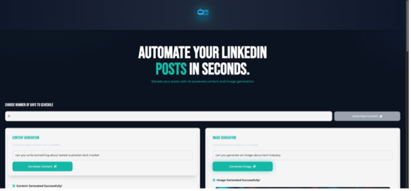
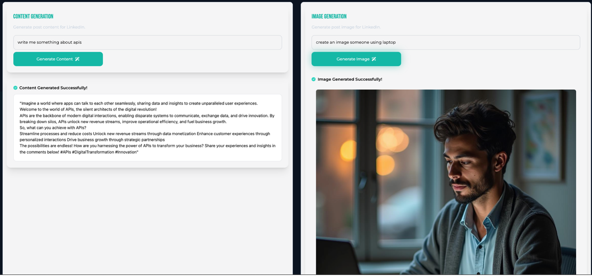
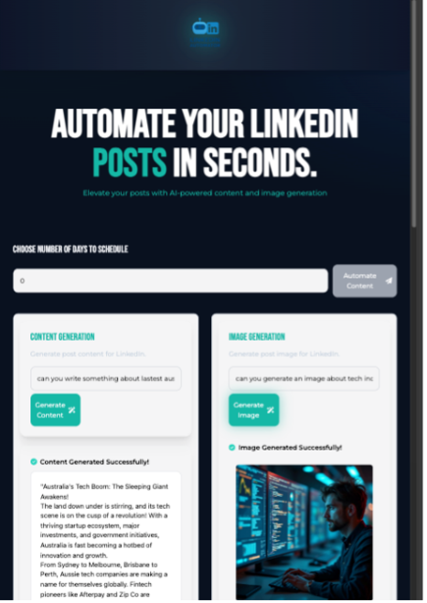
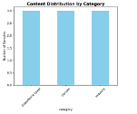
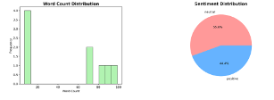
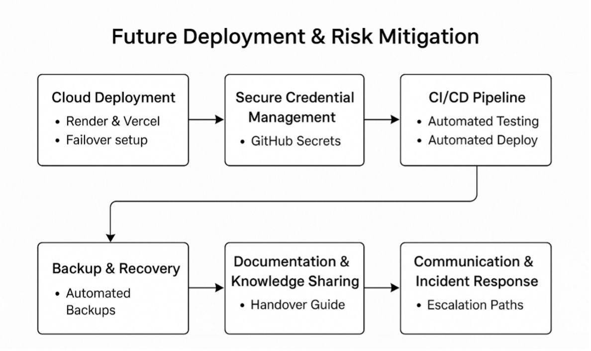
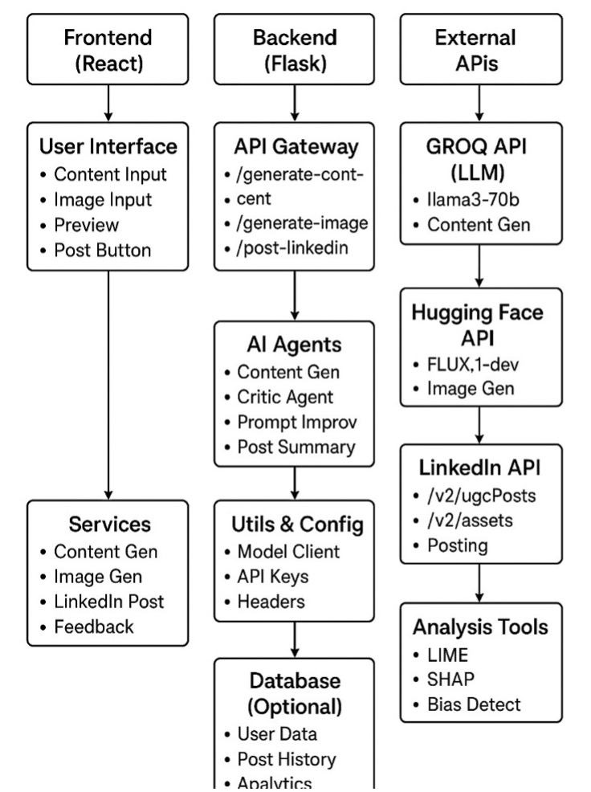
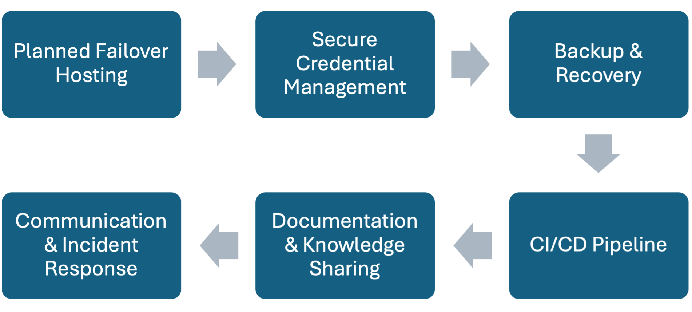
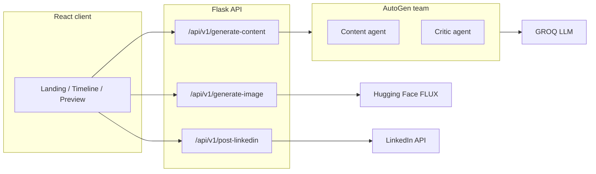

<div align="center">


# LinkedIn Post Automation

### AI-powered copy, images & one-click posting for LinkedIn

[](https://zishan23.github.io/LinkedIn-Post-Automation-Powered-by-AI/)
[](https://github.com/Zishan23/LinkedIn-Post-Automation-Powered-by-AI)

<br/>


<br/>

**[Open the live app →](https://zishan23.github.io/LinkedIn-Post-Automation-Powered-by-AI/)** · Works as a **static UI demo** (mock AI & posting). Run the stack locally for real GROQ, FLUX, and LinkedIn.

</div>

---

## Preview

<table>
  <tr>
    <td align="center" width="50%">
      
    </td>
    <td align="center" width="50%">
      
    </td>
  </tr>
  <tr>
    <td align="center">
      
    </td>
    <td align="center">
      
    </td>
  </tr>
  <tr>
    <td align="center">
      
    </td>
    <td align="center">
      
    </td>
  </tr>
  <tr>
    <td align="center">
      
    </td>
    <td align="center">
      
    </td>
  </tr>
</table>

---

## What it does

1. **Content** — User enters a topic; the backend runs a short **multi-agent** chat (generator + critic) backed by **GROQ** (Llama 3) to produce polished LinkedIn-style text.
2. **Image** — User enters an image prompt; **Hugging Face Inference API** (FLUX.1-dev) generates an image; the API returns PNG bytes.
3. **Preview** — React UI shows markdown-rendered copy and the image together, with a lightweight schedule control in the timeline.
4. **Post** — Backend registers an upload with LinkedIn, uploads the asset when present, and creates a **UGC post** (`/v2/ugcPosts`). Text-only fallback if image upload fails.

## Tech stack

| Layer | Technologies |
|--------|----------------|
| **Frontend** | React 18, Create React App, Tailwind CSS, Axios, react-markdown, Font Awesome, react-hot-toast, lucide-react |
| **Backend** | Python 3.11+, Flask, flask-cors, asyncio |
| **AI — LLM** | Microsoft AutoGen AgentChat (`RoundRobinGroupChat`), GROQ OpenAI-compatible API (`llama3-70b-8192`) |
| **AI — image** | Hugging Face Inference API — `black-forest-labs/FLUX.1-dev` |
| **Integrations** | LinkedIn REST (`/v2/ugcPosts`, asset register/upload) |
| **Research / extras** | `analysis/` — interpretability-style scripts (e.g. LIME/SHAP); optional for running the app |

## Architecture



- **`client/src/components/Timeline.js`** — Orchestrates schedule state, `ContentQuery`, `ImageQuery`, and `Preview`.
- **`server/wsgi.py`** — REST routes; image route returns `generated_image.png` from disk after generation.
- **`server/services/generate_content.py`** — `RoundRobinGroupChat` with `MaxMessageTermination(max_messages=3)` between `content_generation_agent` and `critic_agent`.
- **`server/services/post_linkedin.py`** — Register upload → PUT image → build `ugcPosts` payload (image or text-only).

## Live demo & deploy

| Environment | URL | Notes |
|-------------|-----|--------|
| **GitHub Pages** | [zishan23.github.io/LinkedIn-Post-Automation-Powered-by-AI](https://zishan23.github.io/LinkedIn-Post-Automation-Powered-by-AI/) | Static UI; mock generation when API is unavailable. |
| **Full stack** | Run locally (below) | Real GROQ, Hugging Face FLUX, and LinkedIn posting. |

CI deploys the `client` build to GitHub Pages on push to **`master`** or **`main`**. Manual deploy: see [DEPLOYMENT.md](./DEPLOYMENT.md).

## Prerequisites

- Node.js and npm (Node 18+ for CI / Pages build)
- Python 3.11+
- API keys / tokens:
  - `GROQ_API_KEY`
  - `HUGGINGFACE_API_KEY`
  - `ACCESS_TOKEN` (LinkedIn OAuth, 3-legged, with posting scopes)
  - `PERSON_URN_KEY` (e.g. `urn:li:person:xxxx`)

## Setup

### 1) Backend

```bash
cd server
python3 -m venv venv
source venv/bin/activate   # Windows: venv\Scripts\activate
pip install -r requirements.txt
```

Create `server/.env`:

```env
GROQ_API_KEY=your_groq_key
HUGGINGFACE_API_KEY=your_hf_key
ACCESS_TOKEN=your_linkedin_token
PERSON_URN_KEY=urn:li:person:xxxx
FLASK_ENV=development
PORT=5005
```

Run:

```bash
python wsgi.py
```

### 2) Frontend

```bash
cd client
npm install
```

Create `client/.env`:

```env
REACT_APP_BACKEND_URL=http://localhost:5005
```

Start:

```bash
npm start
```

### GitHub Pages / demo build

The client sets `homepage` for gh-pages. For a **static demo**, `client/src/config/demo.js` provides mock flows when the backend is unreachable. See [DEPLOYMENT.md](./DEPLOYMENT.md).

## How to use

1. Enter a prompt to generate post content.
2. Enter a prompt to generate an image (optional).
3. Review the preview.
4. Click **Post to LinkedIn** (full stack only, with valid token and URN).

## Notes

- LinkedIn token scopes should include: `openid`, `profile`, `email`, `w_member_social`.
- If image upload fails, a text-only post is still attempted.
- Change ports if `5005` or the React dev port is in use.

## Security

- Keep all secrets in `.env` files; do not commit them.
- If this repo was ever public with credentials in code, **rotate** those keys in the provider dashboards.

## License / attribution

Add a license file if you want open-source terms; otherwise default GitHub copyright applies.
